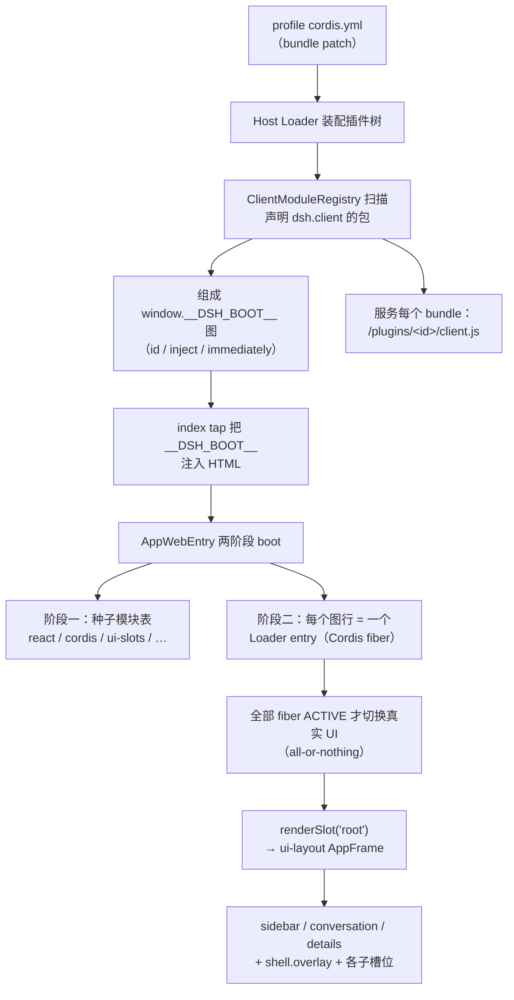

# DSH 插件前端开发指南（Web GUI / Client 插件）

> 本指南是 `D:\codeproject\dsh-plugin` 工作区的“插件前端”专题部分，与
> [插件开发详解](./插件开发详解.md)（通用 Cordis/Host 插件）和
> [发布到社区指南](./发布到社区指南.md)（分发链路）配套阅读。
>
> **版本基线**：`D:\codeproject\deepseek-harness` 源码仓库 `0.1.0-rc.5`，
> commit `47f943859b`。该版本仍是 developer preview，README 明确声明后续可能有兼容性破坏；
> 所有“服务有哪些方法、槽位有哪些字段”类问题，最终以源码 TypeScript 接口为准。

## 0. 一分钟结论

1. **前端插件 = 同一个 Cordis 插件的“浏览器半”**。浏览器里跑的是第二套 Cordis 树：
   Host 侧扫描带 `dsh.client` 声明的包，把 `lib/client.js` 组成启动图注入页面；
   浏览器 Shell 再把每个 bundle 作为 Loader entry 激活。
2. **优先使用增量槽位（Slot）**，不要注册 `root`，也不要覆盖 `sidebar` / `conversation` 等父级
   single 槽位——那会连它声明的所有子槽位一起带走。
3. **最稳的第三方扩展面**：`conversation.input.left/right`、`shell.overlay`、
   `settings.section`、`settings.plugin.item`、`settings.general.item`、
   `conversation.view`、`conversation.session.header.actions`、
   `tool.call.toolview`、`conversation.composer`（chain）、theme token override。
4. **官方构建协议没有 npm SDK**。仓库内用 `packages/client/tsdown.client.ts` preset；
   仓库外独立包目前需要复制该 preset 的等价配置（本指南 §9 给出可直接使用的模板）。
5. **不要 monkey-patch 官方 dist，不要绕过 bundle purity gate**。跨插件协作只走 Cordis
   服务/事件、Slot、Remote/RPC 和 owner props。

## 1. 前端插件是什么：整体架构

### 1.1 启动链路



关键源码（相对 `D:\codeproject\deepseek-harness`）：

| 环节 | 源码 |
|---|---|
| Host 半扫描 `dsh.client`、组成图、`/plugins/*` 路由、index tap | `packages/client/modules/src/index.ts` |
| 浏览器侧模块表（lazy CJS、`window.__ModuleLoader__`） | `packages/client/modules/src/client/**` |
| Shell 两阶段 boot、全 fiber ACTIVE 门 | `packages/client/web/src/boot.tsx` |
| 平台共享模块白名单（bundle 外部化的唯一事实源） | `packages/client/web/src/platform.ts` |
| 官方 client bundle 构建 preset | `packages/client/tsdown.client.ts` |
| Slot 纯核心（register/声明/四种 share） | `packages/client/ui-slots/src/index.ts` |
| Slot 的 Cordis 服务层（`ctx.slots`） | `packages/client/runtime/src/client/slots.ts` |
| 各槽位目录（declare-merge） | `packages/client/ui-{layout,sidebar,settings,settings-plugins,conversation,tool,input-trigger,workspace}/src/client/**` |
| 完整架构审计（本指南的上游依据之一） | `.understand-anything/web-plugin-architecture-audit.zh.md` |

### 1.2 三个必须理解的名词

| 名词 | 含义 |
|---|---|
| **Host 半 / Node 半** | 包主入口 `lib/index.js`（`exports["."]`），在 Node 进程里跑。Host Loader 要 import 它，所以它必须存在并导出 `apply`（哪怕 apply 是空实现）。 |
| **Client 半 / 浏览器半** | `lib/client.js`（`exports["./client"]`），一个 CJS closure-factory bundle。脚本执行时只调用 `window.__ModuleLoader__.load({ id, factory })` 注册工厂，所有副作用（含 CSS 注入）都在工厂真正被物化时发生。 |
| **frozen module table** | 浏览器 Shell 种子化的共享模块表：`react`、`react-dom`、`@deepseek-ai/cordis`、`ui-slots`、`web-react`、`ui-primitives`、`ui-attachment`、`schema-form` 等。你的 bundle 必须把它们**外部化**（`require()`），其余第三方依赖**打进 bundle**。require 一个不在表里的模块 = 运行时抛错。 |

## 2. 一个前端插件包的完整契约

以 `dsh-voice-webspeech`（纯浏览器语音插件）为模板：Host 半几乎为空，价值全在 Client 半。

### 2.1 `package.json`（必须项）

```jsonc
{
  "name": "dsh-voice-webspeech",           // = 插件 id = bundle id = /plugins/<id>/client.js
  "version": "0.1.0",
  "type": "module",
  "main": "lib/index.js",                  // Host 半
  "types": "lib/types/index.d.ts",
  "exports": {
    ".": { "types": "./lib/types/index.d.ts", "default": "./lib/index.js" },
    "./client": { "types": "./lib/types/client/index.d.ts", "default": "./lib/client.js" },
    "./package.json": "./package.json"
  },
  "dsh": {
    "client": {
      "platform": "web",                   // 必填；ClientModuleRegistry 只认 "web"
      "inject": [                          // 浏览器侧“模块边”元数据（包 id，不是服务名）
        "@deepseek-ai/dsh-client-locale",
        "@deepseek-ai/dsh-client-runtime",
        "@deepseek-ai/dsh-client-ui-conversation",
        "@deepseek-ai/dsh-client-ui-settings",
        "@deepseek-ai/dsh-client-ui-settings-plugins"
      ]
      // "immediately": true               // 可选：进入阶段一并行 prefetch 层
    },
    "bundle": { "patch": "./cordis.patch.yml" }   // Host 侧安装时自动应用的补丁
  },
  "files": [
    "lib/**/*.js", "lib/**/*.map", "lib/types/**/*.d.ts",
    "cordis.patch.yml", "src", "README.md", "LICENSE"
  ],
  "scripts": {
    "build": "node -e \"fs.rmSync('lib',{recursive:true,force:true})\" && tsc -p tsconfig.json && tsdown"
  }
}
```

要点：

- `dsh.client.platform` 必须是 `"web"`；`exports["./client"]` 必须存在且指向构建好的 bundle，
  否则 ClientModuleRegistry 构造时**响亮地抛错**（页面停在 loading 并列出问题）。
- `dsh.client.inject` 写的是**包 id**（即启动图里的 row id）；插件源码里导出的
  `export const inject = ['slots', 'locale']` 写的是 **Cordis 服务名**——fiber 会等这些服务就绪。
- `immediately` 只标“阶段一并行预取”。普通 UI 插件不必开；runtime/locale 这类被同步
  `require` 依赖的内核包才需要。
- 一个包可以**只有 Host 半没有 Client 半**（如 `@anweat/dsh-browser`、`dsh-web-search-pro`），
  那就不写 `dsh.client`、不需要 `./client` export、也不需要 tsdown 前端配置。

### 2.2 `cordis.patch.yml`

```yaml
# 纯浏览器插件：host 半为空，只是让自己进入插件树，从而被 client 扫描发现
- insert:
    - id: dsh-voice-webspeech
      name: dsh-voice-webspeech     # 安装后写包名；源码调试可写绝对路径
      config: {}
```

- 该补丁随 `dsh.bundle.patch` 被 profile 合成，Host Loader 由此把包放进插件树；
  ClientModuleRegistry 再沿 Loader rows 扫描 `dsh.client`。
- 包解析锚定在 `ctx.baseUrl`（cordis.yml 所在目录）：profile 的 `package.json` 必须把
  该包声明为依赖（`dsh plugin add` 会替你完成）。

### 2.3 Host 半的最小形态

```ts
// src/index.ts —— 纯 client 插件可以空到只剩一个日志
import type { Context } from '@deepseek-ai/cordis'

export const name = 'dsh-voice-webspeech'

export function apply(ctx: Context): void {
  console.log('[dsh-voice-webspeech] loaded')
}
```

> Host+Client 双插件（如 `dsh-restart`）则把工具/命令/设置 section/HTTP 路由写在 Host 半，
> 把设置卡片写在 Client 半，两者通过 settings namespace 或自有路由协作（§6.3、§11）。

## 3. 两条开发路径：仓库内 vs 独立 npm 包

| 维度 | 仓库内（`packages/client/<name>`） | 独立 npm 包（本工作区推荐给社区插件） |
|---|---|---|
| 构建配置 | 直接用官方 `packages/client/tsdown.client.ts` 的 `clientBundle(id, libEntry)` | 自带一份等价 tsdown 配置（§9 模板） |
| tsconfig | 继承 `tsconfig.base.client.json` | 自带 `tsconfig.json`（§9） |
| 加载 | `pnpm dsh web --patch <cordis.yml>`（源码直接跑） | `pnpm dsh plugin --profile web add <pkg/./github:...>`，重启 `dsh web` |
| HMR | `pnpm run dev:web` 官方 watcher | 官方 watcher 不扫描仓库外包；稳定回路是 rebuild + 刷新/重启（§10） |
| 类型获取 | 源码相对路径直连 | 通过 `optional peerDependencies` 安装 `@deepseek-ai/dsh-client-*`，开发时可用 `dev:link-dsh` 软链到源码仓库 |
| 分发 | 随仓库发布 | npm / GitHub / tarball（见发布指南） |

### 3.1 仓库内开发的完整回路

```sh
# 仓库根：D:\codeproject\deepseek-harness
pnpm dsh web --patch D:/codeproject/dsh-plugin/plugins/<插件名>/cordis.yml
# 另一终端：
pnpm run dev:web          # 只监视 packages/*/* 中带 dsh.client 声明的包并重写 lib/client.js
```

`dev:web` 只重写 bundle；Shell/HTML/平台模块/普通 package 改动需要重新 build web artifacts 并刷新。

### 3.2 独立包开发的完整回路

```sh
# 1. 首次：把 deepseek-harness 源码里的类型契约软链进本包（参考 dsh-voice-webspeech）
pnpm install
pnpm run dev:link-dsh -- --source /absolute/path/to/deepseek-harness

# 2. 迭代：tsc 出 lib/index.js + lib/types，tsdown 出 lib/client.js
pnpm run build

# 3. 激活（三选一）
pnpm dsh plugin --profile web add .                          # 本地 checkout 链接进 profile
pnpm dsh plugin --profile web add github:anweat/<repo>       # git 安装（需已提交 lib/）
pnpm dsh plugin --profile web add <name>@<version>           # npm 安装

# 4. 重启 dsh web（客户端 bundle 在启动时进图）
pnpm dsh web
```

> 独立包的开发环境建议直接以 `dsh-voice-webspeech` / `dsh-restart` 为骨架：
> `package.json` + `tsconfig.json` + `tsdown.config.ts` + `scripts/link-dsh-workspace.mjs`
> + `scripts/check-client-bundle.mjs` 五件套，缺一不可。

## 4. Client 插件源码骨架

### 4.1 最小入口

```ts
// src/client/index.ts
import type { ClientContext } from '@deepseek-ai/dsh-client-runtime/client'
import type {} from '@deepseek-ai/dsh-client-ui-slots'          // SlotMap / PropsLocale
import type {} from '@deepseek-ai/dsh-client-locale/client'     // ctx.locale 的 declare merge
import type {} from '@deepseek-ai/dsh-client-ui-conversation/client' // conversation.* 槽位类型
import { MicButton } from './MicButton.tsx'
import { zh, en } from './locales.ts'

export const name = 'my-widget-client'
export const inject = ['slots', 'locale']        // Cordis 服务依赖

export const NS = 'my.widget'

export function apply(ctx: ClientContext): void {
  // 1. 词典注册：可逆 effect，卸载自动移除
  ctx.effect(() => ctx.locale.register(NS, { zh, en }), 'my-widget: dictionaries')

  // 2. 等槽位被声明后再注册贡献（声明者先启动、后启动都安全）
  ctx.slots.inject('conversation.input.left', () => ctx.slots.register({
    name: 'conversation.input.left',
    id: 'my-widget-mic',          // list 槽位唯一 id
    order: 10,                    // 升序排列
    locale: NS,                   // 组件收到标准 t seat
    inject: () => ({}),           // 组件额外 props（业务注入面）
  }, MicButton))
}
```

### 4.2 类型与 Context

外部包没有仓库内 tsconfig 的 path 映射，靠**类型 import + declare merge** 获得全部类型：

```ts
// src/client/context-types.ts
import type { ClientContext } from '@deepseek-ai/dsh-client-runtime/client'
import type {} from '@deepseek-ai/dsh-client-locale/client'
import type {} from '@deepseek-ai/dsh-client-ui-conversation/client'
import type {} from '@deepseek-ai/dsh-client-ui-settings/client'
import type {} from '@deepseek-ai/dsh-client-ui-settings-plugins/client'
import type { zh } from './locales.ts'

declare module '@deepseek-ai/dsh-client-ui-slots' {
  interface LocaleNamespaceMap {
    'my.widget': keyof typeof zh   // t('...') 的键被静态检查
  }
}

export type Context = ClientContext
```

要点：

- **值 import 与类型 import 的边界就是生死线**：bundle purity gate 只拦
  `@deepseek-ai/*` 的**值**导入；`import type` 会被擦除，可以随便引用任意包的 client 类型。
- 想要某个服务的 `ctx.xxx` 类型，就 `import type {} from '.../client'` 拉进它的 declare merge。
- `ClientContext` 本质就是合并后的 Cordis `Context`。

### 4.3 常用服务速查（`ctx.*`）

| 服务名 | 提供方 | 用途 |
|---|---|---|
| `slots` | `dsh-client-runtime` | `register / inject / entries / subscribe / getVersion / snapshot`，前端插件的核心 API |
| `sessions` / `workspaces` | `dsh-client-runtime` | 会话/工作区对象层与列表动作 |
| `locale` | `dsh-client-locale` | `register(ns, {zh,en})` / `bind(ns)` / `subscribe` |
| `settingsScope` | `dsh-client-ui-settings` | `bind({ namespace })` → Host 设置的浏览器镜像（§6.3） |
| `connection` | `dsh-client-connection` | `ConnectionHandle`（`api.*` RPC、连接生命周期） |
| `remote` | `dsh-api-remotes`（client 半） | `$on` 转发事件、allowlist 内的 RPC |
| `theme` | `dsh-client-ui-theme` | 主题注册 / token override（§7） |
| `layout` | `dsh-client-ui-layout` | 面板几何动作（开 details 面板等），依赖官方 layout 在组合中 |

依赖怎么写：源码里 `export const inject = [...]`（服务名），
`package.json` 的 `dsh.client.inject` 里写对应**包 id**（用于启动图元数据）。

## 5. Slot（槽位）系统：前端扩展的唯一正确入口

### 5.1 模型

- **声明即授权**：某个 slot 只能有一个声明者（declaring entry）。父槽位的 occupant
  在同一笔 `register({ children })` 里声明子槽位；父 registration 卸载会**递归撤销**全部子槽位。
- **贡献 vs 替换**：`list`/`keyed`/`chain` 是增量贡献；`single` 只有一个 winner，
  再注册一个就是**替换（shadow）**整区。
- **作用域**：
  - `root`：页面级；
  - `session`：每个会话一个实例，框架注入 `sessionId` 与 session 标准 kit；
  - `session-maybe`：跨“无会话 hero ↔ 有会话”保持同一 React 身份。
- **动态插件降权**：动态 runner 注册的非 chain 槽位会拿到低于 shipped UI 的 priority，
  对 single 槽位而言它会成为 winner——**动态 shadow 一个 single 槽位 = 整区只剩你**。

### 5.2 `ctx.slots.register(options, Component)` 的选项

| 选项 | 适用 | 含义 |
|---|---|---|
| `name` | 全部 | 目标槽位键 |
| `id` | list/keyed | 稳定 id（list 去重、keyed 路由）；建议带插件前缀 |
| `order` | list | 升序渲染顺序 |
| `key` | keyed | 业务 key（如 tool 名），open-key 域，拼错只会不渲染 |
| `label` | settings.section / settings.plugins.tab | 导航文案，写函数以跟随语言切换重注册 |
| `locale` | 全部 | 词典 namespace；组件获得 `t` |
| `inject` | 全部 | 返回组件的业务 props（见下） |
| `store` | 全部 | 共享 store handle 或独占工厂（`useStore`/`actions` 成为标准 props） |
| `children` | 仅声明者 | 一次声明子槽位树（`{ key: { kind, scope } }`） |
| `select` / `priority` | chain | 纯函数竞选器 / 升序优先级，首个非 null 结果当选，组件收到 `matched` |

组件的 props 是**四份 share 的交集**：

```text
PropsRuntime（owner props + session/global 标准 kit + 框架 hooks）
& PropsRenderSlots（你声明过的子槽位 → renderSlot 函数）
& PropsStore（useStore + actions）
& inject() 返回值（业务面，钩子放入保留的 hooks 分区）
& PropsLocale（t）
```

`ctx.slots.register()` 已经跑在调用方 fiber 的 effect 里：**插件卸载时自动注销**，不需要自己保存 disposer。

### 5.3 `ctx.slots.inject(name, callback)`：声明等待

大多数第三方插件都往**别人声明的槽位**里注册。直接 `register` 到未声明槽位会 throw；
正确姿势是 `ctx.slots.inject`：

- 槽位已经声明 → 同步执行 callback；
- 还没声明 → 等；声明 collapse → 清掉贡献；重新声明 → 重跑 callback；
- callback 可以返回一个 disposer，也可以返回**可迭代 disposer（generator）**，
  把多个 `register` 装进一个事务：中途失败回滚、卸载逆序清理。

```ts
ctx.slots.inject('settings.plugin.item', function* () {
  yield ctx.slots.register({ name: 'settings.plugin.item', id: 'card-a', order: 10 }, CardA)
  yield ctx.slots.register({ name: 'settings.plugin.item', id: 'card-b', order: 20 }, CardB)
})
```

### 5.4 槽位目录（第三方插件常用子集）

> 全量目录以各包 `src/client/**` 的 `interface SlotMap` declare merge 为准（审计时为约 42 个）。
> 下表标注了 kind/scope，并给出“加功能该往哪放”。

#### 全局壳层

| 槽位 | kind/scope | 说明 |
|---|---|---|
| `root` | single / root | 页面根。**永远不要注册**——shadow 它会替换整个 AppFrame，所有子槽位消失 |
| `shell.overlay` | list / root | 页面级浮层（toast、徽标、全局面板）。click-through，默认不挡交互 |
| `sidebar` | single / root | 整条左栏（官方 occupant 声明了 workspaces/settings/footer 子槽位）。**替换需自担全部子面** |
| `sidebar.footer.action` | list / root | 左栏底部 Settings 旁的额外动作按钮 |
| `details` | single / session | 右侧详情栏（替换需自担 tool 面板） |

#### 设置面

| 槽位 | kind/scope | 说明 |
|---|---|---|
| `settings.section` | list / root | 一个完整设置页（owner 给 `close`；用 `id/order/label` 表达导航） |
| `settings.plugins.tab` | list / root | “插件”设置页里的一个 tab |
| `settings.plugin.item` | list / root | **插件自己的配置卡片**（§6.2/6.3），设置 → 插件 → 可配置 |
| `settings.general.item` | list / root | 常规设置页里的单行偏好 |
| `settings.action` | list / root | 设置面板标题栏动作 |
| `settings.onboarding` | list / root | 引导步骤（较特殊，先别碰） |
| `settings.trigger` / `settings.header` / `settings.close` | single / root | 设置壳的文案/内容位，一般不需要动 |

#### 会话与输入面

| 槽位 | kind/scope | 说明 |
|---|---|---|
| `conversation` | single / session-maybe | 整个中栏。**替换会带走全部会话子槽位** |
| `conversation.session` | single / session | 单个会话 body（替换即自己渲染整个会话） |
| `conversation.session.header` | single / session | 会话标题行 |
| `conversation.session.header.actions` | list / session | 标题行动作按钮（增量） |
| `conversation.session.header.utilities` | list / session | 标题行右端工具 |
| `conversation.view` | list / session | 会话视图 tab（如新增“轨迹/规划”式整页视图） |
| `conversation.chat.node` | keyed / session | 按业务 node kind 分发最终渲染器 |
| `conversation.chat.commandview` | keyed / session | 按 `/command` 名分发命令行卡片 |
| `conversation.chat.turnTail` | chain / session | Turn 尾部扩展链 |
| `conversation.chat.assistant-actions` | list / session | 消息级动作（增量） |
| `conversation.composer` | chain / session | **composer 接管链**（selector 路由，全拒绝回退默认输入条） |
| `conversation.composer.bar` | single / session-maybe | 默认输入条本身（替换需自担 plan/model 等子位） |
| `conversation.composer.dock` | list / session | 输入卡下方的环境读数行 |
| `conversation.input.dock` | list / session | 输入卡上方整行（队列/todo/goal bar） |
| `conversation.input.left` | list / session | 输入条左端小控件（语音按钮等，**最常用**） |
| `conversation.input.right` | list / session | 输入条右端小控件 |
| `conversation.input.overlay` | list / session | 输入浮层锚点 |
| `conversation.input.plan` / `conversation.input.model` | single / session | 具名 plan/model 位（替换需自担整个能力） |
| `conversation.hero.workspace` | single / root | 空白态 workspace 选择器 |
| `conversation.hero.agentPreset` | single / root | 空白态 agent preset 位 |

#### 工具 / 目录流

| 槽位 | kind/scope | 说明 |
|---|---|---|
| `tool.call.toolview` | keyed / session | 按工具名分发工具调用视图（**给自己的工具做 UI 卡片的入口**） |
| `conversation.details.tool` | single / session | 详情栏里的整块工具输出面板（替换需渲染所有工具） |
| `conversation.hero.workspace.directoryFlow` | single / root | workspace 目录选择交互（native chooser / 浏览对话框插件） |
| `sidebar.workspaces.directoryFlow` | single / root | 同上，侧栏入口 |

### 5.5 选槽位的决策表

| 你想做什么 | 用哪个槽位 |
|---|---|
| 输入框旁边放一个小按钮 | `conversation.input.left`（靠发送键用 `.right`） |
| 全局浮层 / 状态提示 | `shell.overlay` |
| 插件自己的设置页 | `settings.section` |
| 插件自己的配置卡片 | `settings.plugin.item` |
| 单个偏好行 | `settings.general.item` |
| 自己的工具调用有专属视图 | `tool.call.toolview`，`key: '<tool name>'` |
| 替换整块 composer（审批、问题面板） | `conversation.composer`（chain + selector） |
| 给会话加个新视图 tab | `conversation.view` |
| 会话标题栏加按钮 | `conversation.session.header.actions` |

## 6. 三个实战模式（本工作区已上线插件验证）

### 6.1 Composer 小控件（`dsh-voice-webspeech` 模式）

```tsx
// src/client/MicButton.tsx（简化）
import type { PropsLocale } from '@deepseek-ai/dsh-client-ui-slots'
import type { InputZone } from '@deepseek-ai/dsh-client-ui-conversation/client'

export type MicButtonProps = PropsLocale<'voice.webspeech'> & InputZone

export function MicButton({ t }: MicButtonProps) {
  return <button type="button" aria-label={t('title')} onClick={...}>🎙</button>
}
```

```ts
// src/client/index.ts（注册，见 4.1）
ctx.slots.inject('conversation.input.left', () => ctx.slots.register({
  name: 'conversation.input.left',
  id: 'voice-webspeech-recorder',
  order: 10,
  locale: LOCALE_NS,
  inject: () => ({}),
}, RecorderButton))
```

已上线实现：`D:\codeproject\dsh-voice-webspeech\src\client\`。
偏好存 localStorage（`loadPrefs / updatePrefs / subscribePrefs`），
组件用 `useSyncExternalStore` 订阅——**快照必须返回稳定引用**，否则 React 判定每次都变而无限重渲染
（该插件实测踩过这个坑：按钮被错误边界 abdicate 后直接消失）。

### 6.2 插件配置卡片（localStorage 版，无需 Host 写权限）

适合纯浏览器偏好，不落 `settings.yaml`：

```ts
ctx.slots.inject('settings.plugin.item', () => ctx.slots.register({
  name: 'settings.plugin.item',
  id: 'my-plugin',
  order: 30,
  locale: NS,
  inject: () => ({}),        // 不需要 Host 写路径，注入面留空
}, SettingsCard))
```

卡片组件契约（`settings.plugin.item` 的 owner 是空面，只给 `t`）：

```tsx
import type { PropsLocale } from '@deepseek-ai/dsh-client-ui-slots'

export type SettingsCardProps = PropsLocale<'my.widget'>
export function SettingsCard({ t }: SettingsCardProps) {
  // 根节点用 <li>（该槽位渲染在 <ul> 卡片列表里），自绘折叠卡片
  return <li>…{t('title')}…</li>
}
```

参考：`D:\codeproject\dsh-voice-webspeech\src\client\SettingsCard.tsx`。

### 6.3 插件配置卡片（Host settings 版，`dsh-restart` 模式）

让卡片编辑的数据**持久化到 `$DSH_HOME/settings.yaml` 并让 Host 半读到**：

Host 半（`src/index.ts`）：

```ts
import { installSettingsSection, settingsNamespace } from '@deepseek-ai/dsh-settings'
import { Schema } from '@deepseek-ai/schemastery'

export const inject = ['tools', 'commands', 'agents', 'shell', 'sandboxPolicy']

export interface RestartConfig {
  legacyRestart: boolean
  continuePrompt: string
  watchdogEnabled: boolean
  // ...
}

export const RestartConfigSchema: Schema<RestartConfig> = Schema.object({
  legacyRestart: Schema.boolean().default(false),
  continuePrompt: Schema.string().default(''),
  watchdogEnabled: Schema.boolean().default(false),
  // …其余字段与 RestartConfig 接口一一对应
})

export const DEFAULT_CONFIG: RestartConfig = {
  // 每个字段给一个默认值（与 Schema.default 保持一致）
  legacyRestart: false,
  continuePrompt: '',
  watchdogEnabled: false,
}

export function apply(ctx: Context): void {
  let resolveConfig = () => DEFAULT_CONFIG
  installSettingsSection(ctx, settingsNamespace('dsh-restart'), RestartConfigSchema, DEFAULT_CONFIG, {
    setSource: (get) => { resolveConfig = get },   // 每次动态取当前配置
    onChange: () => {},
  })
  // ...后面注册工具/命令/HTTP 路由
}
```

Client 半（`src/client/index.ts`，简化自 dsh-restart）：

```ts
import { createSnapshotStore, type SnapshotStore } from '@deepseek-ai/dsh-client-runtime/client'

export const inject = ['slots', 'locale', 'settingsScope']

export function apply(ctx: Context): void {
  ctx.effect(() => ctx.locale.register(NS, { zh, en }))

  // 绑定 Host 侧同名 namespace 的浏览器镜像
  const scope = ctx.settingsScope.bind({ namespace: 'dsh-restart' })

  const project = (): CardState => {
    const snap = scope.getSnapshot()
    // snap: { status:'loading'|'ready'|'unavailable', value, base, user,
    //         revision, writable, mode:'host'|'memory' }
    return {
      available: snap.status === 'ready',
      writable: snap.writable,
      legacyRestart: (snap.value ?? {}).legacyRestart === true,
      // ...
    }
  }
  const store: SnapshotStore<CardState> = createSnapshotStore(project())
  scope.subscribe(() => { store.set(project()) })

  ctx.slots.inject('settings.plugin.item', () => ctx.slots.register({
    name: 'settings.plugin.item',
    id: 'dsh-restart',
    order: 40,
    locale: NS,
    inject: () => ({
      hooks: { dshRestart: store },                       // 渲染器绑定成 useDshRestart hook
      set: (field, value) => { void scope.set(field, value) },
      clear: (field) => { void scope.unset(field) },
    }),
  }, SettingsCard))
}
```

卡片组件里：

```tsx
export function SettingsCard(props: SettingsCardProps) {
  const { t, set, clear } = props
  const state = props.useDshRestart(snapshot => snapshot)
  if (!state.available) return null            // namespace 未就绪：不渲染
  const disabled = !state.writable             // 远端页面/memory mode：只读
  // set('legacyRestart', checked) / clear('continuePrompt') …
}
```

写语义要点（`runtime/src/client/contract/settings-scope.ts`）：

- `status === 'ready'` 才可用；`unavailable` 表示该 namespace 未对本客户端暴露。
- `set/unset` 按 revision 排队防并发写冲突；被拒绝的最新写会回读 Host 状态。
- 字段是否“被覆盖”看 `user` 层**是否存在该键**，不看值是否等于默认值。

参考：`D:\codeproject\dsh-restart\src\client\index.ts` 与 `SettingsCard.tsx`。

### 6.4 给工具注册专属视图（keyed）

```ts
// key 域是开放的 wire tool name：拼错 = 永不渲染，不报错
ctx.slots.inject('tool.call.toolview', () => ctx.slots.register(
  { name: 'tool.call.toolview', key: 'my_tool_name', locale: NS },
  MyToolView,
))
```

组件收到 `ToolCallOwnerProps`：`callId / toolName / block / cwd / openFile / inspect`。
参考 `packages/client/ui-skill/src/client/index.ts`（key `'skill'`）。

## 7. 主题与 CSS

### 7.1 Theme 服务

`ctx.theme` 由 `ui-theme` 提供（默认 web 组合里有；依赖 `ui-layout` 的 ThemePresenter 写 DOM）：

```ts
import type {} from '@deepseek-ai/dsh-client-ui-theme/client'   // ctx.theme 类型

export const inject = ['slots', 'theme']

export function apply(ctx: Context): void {
  // 1) 注册一个可选主题（tokens 是 --dsw-alias-* 的覆盖字典）
  ctx.effect(() => ctx.theme.register({
    id: 'ocean',
    colorScheme: 'dark',
    tokens: {
      '--dsw-alias-bg-base': '#0b1220',
      '--dsw-alias-label-primary': '#e6edf3',
    },
  }))

  // 2) 或叠加一个 token 覆盖层（可逆，不用整主题）
  ctx.effect(() => ctx.theme.overrideTokens('my-plugin', {
    '--dsw-alias-bg-base': { light: '#ffffff', dark: '#0b1220' },
  }))

  // 3) 切到某个已注册主题 / 观察变化
  ctx.theme.setTheme('ocean')
  ctx.on('theme/change', (snap) => { /* snap.active.tokens … */ })
}
```

约束：

- `overrideTokens` 的值必须是 `{ light, dark }` 对；传裸字符串会得到教学型 TypeError。
- 第三方 theme/override 要等 Client 插件激活后才生效，**不能承诺自定义品牌主题零闪烁**。
- ThemePresenter 属于 `ui-layout`：Profile 里禁用官方 layout 会连 DOM theme 呈现一起丢。

### 7.2 CSS Modules

官方 preset 用 lightningcss 把 `*.module.css` 编译成 hashed class map，并在工厂执行时注入
`<style data-plugin="<插件id>" data-plugin-css="<id>/<文件名>">`；插件卸载时由 loader 清掉
属于它的 style tag。外部包在 §9 的配置里带了等价的 CSS plugin。

```tsx
import css from './MyCard.module.css'
export function MyCard() {
  return <div className={css.card}>…</div>
}
```

配套 `css-modules.d.ts`（voice 插件踩过 TS2307）：

```ts
declare module '*.module.css' {
  const classes: Record<string, string>
  export default classes
}
```

### 7.3 样式建议

- 颜色用语义 token `var(--dsw-alias-*)`，不要硬编码色值；
- 不要写会泄漏到全局的裸选择器；CSS Modules 或 JS 内联样式对象都行
  （`dsh-restart` 的 `styles.ts` 是不用 CSS Modules 的合法替代）；
- 动态注入的全局 CSS 没有 selector namespace / Shadow DOM 隔离，不是稳定结构 API。

## 8. 国际化（locale）

```ts
// locales.ts
export const zh = { title: '我的控件', send: '发送' }
export const en = { title: 'My control', send: 'Send' }
```

```ts
// 类型收紧（context-types.ts）
declare module '@deepseek-ai/dsh-client-ui-slots' {
  interface LocaleNamespaceMap { 'my.widget': keyof typeof zh }
}
```

- `ctx.effect(() => ctx.locale.register(NS, { zh, en }))`；
- 槽位注册时写 `locale: NS` → 组件收到 `t`；
- settings 导航 `label` 必须写函数（`label: () => t('nav')`），语言切换时重注册出新文案；
- 包 `dsh.client.inject` 里加 `@deepseek-ai/dsh-client-locale`，源码 `inject` 里加 `'locale'`。

## 9. 构建协议：外部包必须复制的东西

### 9.1 官方 preset 实际上做了什么

`packages/client/tsdown.client.ts` 的 `clientBundle(id, libEntry)`：

1. Node 半：tsdown 出 `lib/index.js`（ESM、node 平台）；
2. Client 半：`src/client/index.ts`（或 `lib/types/client/index.js`）→ `lib/client.js`：
   CJS、browser 平台、`clean: false`（保住 Node 半产物）、sourcemap；
3. **平台模块外部化**：`PLATFORM_MODULES`（下表）加 `@deepseek-ai/dsh-client-runtime/client`
   这一临时豁免；其余依赖全部 inline；
4. **purity gate**：`@deepseek-ai/*` 的值导入若不在白名单（外部项 / inline-safe wire 层 /
   vendored 库 / generated `/remote`）直接构建报错；
5. **CSS Modules**：lightningcss 编译 + `<style data-plugin>` 注入；
6. **closure 封装**：banner `window.__ModuleLoader__.load({ id, factory: (require) => {`,
   footer `return module.exports; } });`，intro 定义 `module/exports`。

平台模块表（`packages/client/web/src/platform.ts`）：

```ts
'react', 'react/jsx-runtime', 'react-dom', 'react-dom/client', '@deepseek-ai/cordis',
'@deepseek-ai/dsh-client-ui-slots',
'@deepseek-ai/dsh-client-web-react',
'@deepseek-ai/dsh-client-ui-primitives',
'@deepseek-ai/dsh-client-ui-attachment',
'@deepseek-ai/dsh-client-schema-form',
// + 官方 preset 追加的临时豁免：
'@deepseek-ai/dsh-client-runtime/client',
```

### 9.2 外部包 tsconfig

`tsc` 出 Node 半与类型；`tsdown` 只出 client bundle：

```jsonc
{
  "compilerOptions": {
    "target": "ES2022",
    "lib": ["ES2024", "DOM", "DOM.Iterable"],
    "module": "esnext",
    "moduleResolution": "bundler",
    "jsx": "react-jsx",
    "outDir": "lib",
    "rootDir": "src",
    "declaration": true,
    "declarationDir": "lib/types",
    "allowImportingTsExtensions": true,
    "rewriteRelativeImportExtensions": true,
    "strict": true,
    "noUncheckedIndexedAccess": true,
    "skipLibCheck": true,
    "noEmitOnError": true,
    "isolatedModules": true,
    "types": ["node"]
  },
  "include": ["src"],
  "exclude": ["tests", "lib"]
}
```

### 9.3 外部包 tsdown 配置（模板）

```ts
// tsdown.config.ts —— 外部包等价实现官方 clientBundle 的 Client 半
import { readFile } from 'node:fs/promises'
import { basename, dirname, relative, resolve as resolvePath, sep } from 'node:path'
import { fileURLToPath } from 'node:url'
import type { UserConfig } from 'tsdown'
import { transform } from 'lightningcss'

const PLUGIN_ID = 'my-web-widget'

const CLIENT_EXTERNALS = [
  'react', 'react/jsx-runtime', 'react-dom', 'react-dom/client',
  '@deepseek-ai/cordis',
  '@deepseek-ai/dsh-client-runtime/client',
  '@deepseek-ai/dsh-client-ui-slots',
  // 你的组件用到哪个平台模块，就把哪个加进来（必须与 platform.ts 一致）
] as const

const CSS_VIRTUAL_PREFIX = '\0dsh-css:'
const CSS_VIRTUAL_SUFFIX = '.mjs'
const REPOSITORY_ROOT = dirname(fileURLToPath(import.meta.url))

export default {
  name: `${PLUGIN_ID}/client`,
  entry: { client: 'src/client/index.ts' },
  outDir: 'lib',
  format: 'cjs',
  platform: 'browser',
  dts: false,
  sourcemap: true,
  clean: false,                       // ★ 否则会删掉 tsc 刚写出的 lib/index.js
  codeSplitting: false,
  deps: {
    neverBundle: [...CLIENT_EXTERNALS],
    alwaysBundle: (id: string) =>
      (CLIENT_EXTERNALS.includes(id as (typeof CLIENT_EXTERNALS)[number]) ? undefined : true),
  },
  define: {
    'process.env.NODE_ENV': JSON.stringify(process.env.NODE_ENV ?? 'production'),
    'import.meta.env.MODE': JSON.stringify(process.env.NODE_ENV ?? 'production'),
    'import.meta.env': JSON.stringify({ MODE: process.env.NODE_ENV ?? 'production' }),
  },
  plugins: [
    {
      // bundle purity gate：与官方一致的构建期边界
      name: 'dsh-client-bundle-purity',
      resolveId(source: string) {
        if (!source.startsWith('@deepseek-ai/')) return null
        if (CLIENT_EXTERNALS.includes(source as (typeof CLIENT_EXTERNALS)[number])) return null
        throw new Error(
          `client bundle purity: "${source}" is not a platform module — `
          + 'cross-plugin value imports are forbidden; collaborate through cordis services '
          + '(type-only imports are erased and never reach this gate)',
        )
      },
    },
    {
      // CSS Modules：hashed class map + <style data-plugin> 注入（不用 CSS Modules 可删除）
      name: 'dsh-css-inline',
      resolveId(source: string, importer: string | undefined) {
        if (!source.endsWith('.module.css')) return null
        const abs = importer === undefined ? source : resolvePath(dirname(importer), source)
        const repoRel = relative(REPOSITORY_ROOT, abs).split(sep).join('/')
        return CSS_VIRTUAL_PREFIX + repoRel + CSS_VIRTUAL_SUFFIX
      },
      async load(virtualId: string) {
        if (!virtualId.startsWith(CSS_VIRTUAL_PREFIX)) return null
        const repoRel = virtualId.slice(CSS_VIRTUAL_PREFIX.length, -CSS_VIRTUAL_SUFFIX.length)
        const fileId = resolvePath(REPOSITORY_ROOT, repoRel)
        this.addWatchFile(fileId)
        const { code, exports: cssExports } = transform({
          filename: fileId,
          code: await readFile(fileId),
          cssModules: { pattern: '[hash]_[local]' },
          minify: true,
        })
        const classMap: Record<string, string> = {}
        for (const [local, exp] of Object.entries(cssExports ?? {})) classMap[local] = exp.name
        const tagId = `${PLUGIN_ID}/${basename(fileId)}`
        return [
          `const css = ${JSON.stringify(code.toString())};`,
          `const tagId = ${JSON.stringify(tagId)};`,
          `if (typeof document !== 'undefined' && document.querySelector('style[data-plugin-css=' + JSON.stringify(tagId) + ']') === null) {`,
          `  const tag = document.createElement('style');`,
          `  tag.dataset.plugin = ${JSON.stringify(PLUGIN_ID)};`,
          `  tag.dataset.pluginCss = tagId;`,
          `  tag.textContent = css;`,
          `  document.head.appendChild(tag);`,
          `}`,
          `export default ${JSON.stringify(classMap)};`,
        ].join('\n')
      },
    },
  ],
  outputOptions: {
    entryFileNames: 'client.js',
    banner: `window.__ModuleLoader__.load({ id: ${JSON.stringify(PLUGIN_ID)}, factory: (require) => {`,
    footer: 'return module.exports; } });',
    intro: 'var module = { exports: {} }; var exports = module.exports;',
  },
} satisfies UserConfig
```

> 本模板即 `D:\codeproject\dsh-voice-webspeech\tsdown.config.ts`（带 CSS Modules）与
> `D:\codeproject\dsh-restart\tsdown.config.ts`（不带 CSS Modules）的合并简化版。
> 若依赖里有 Node-first 的包（voice 的 transformers/onnxruntime-web），还要像 voice 那样加
> `resolveId` 把浏览器 artifact 显式指出来，否则 Node builtin 会漏进浏览器 bundle。

### 9.4 构建与离线校验

```sh
pnpm run build
# 预期产物：
# lib/index.js            Host 半（导出 apply）
# lib/types/**/*.d.ts     类型
# lib/client.js           浏览器半（banner + closure factory）
# lib/client.js.map
```

`scripts/check-client-bundle.mjs` 至少校验（voice 的脚本是现成参考）：

- `dsh.client.platform === 'web'`；
- `exports["./client"]` 指向存在的 `lib/client.js`；
- bundle 以 `window.__ModuleLoader__.load({ id: "<包名>"` 开头、以 footer 结尾；
- 除允许的外部化列表外，没有其它 `@deepseek-ai/*` 的 `require(...)`；
- `lib/index.js` 导出 `apply`；`cordis.patch.yml` 有对应 insert 行。

### 9.5 构建踩坑清单

1. **`clean: true` 会清掉 tsc 产物**：先 tsc 后 tsdown，必须 `clean: false`。
2. **CSS Modules 缺 `.d.ts`** → TS2307（§7.2）。
3. **同名 `.d.ts` 与 `.ts`**：TypeScript 会把前者当后者的输出声明而忽略其
   `declare global`（voice 实测，重命名 `webspeech.d.ts` 解决）。
4. **`useSyncExternalStore` 快照不稳定** → React 无限重渲染、槽位 entry 被 abdicate
   （voice 实测，`loadPrefs` 必须返回稳定引用）。
5. **外部化表写错**：外部化了一个不在平台模块表里的包 → 运行时 require 抛错；
   反过来内联了 react/ui-slots → 双实例或 Symbol 身份断裂。**以 platform.ts + runtime/client
   豁免为准**。
6. **跨插件值导入**：purity gate 会拦住；类型导入不拦。协作走服务/事件/槽位。
7. **git 安装但没提交 `lib/`**：用户装源码会跑 `prepare` 构建，受 pnpm allowBuilds
   信任门槛影响；直接提交 `lib/`（voice 的做法）则免 build。

## 10. 启动、调试与 HMR

### 10.1 激活与验证

```sh
# 仓库外插件：
pnpm dsh plugin --profile web add github:anweat/dsh-voice-webspeech
pnpm dsh web          # 重启；打开 http://127.0.0.1:3080

# 仓库内插件：
pnpm dsh web --patch D:/codeproject/dsh-plugin/plugins/<插件名>/cordis.yml
```

验证顺序：

1. `curl http://127.0.0.1:3080/plugins/<插件id>/client.js` 应返回 bundle（banner 开头）；
2. 页面加载后插件 UI 出现；Console 无 fiber FAILED；
3. 如果页面停在 loading：boot 是 all-or-nothing，`AppWebEntry.assertEntriesActive()`
   会把“哪个 entry、为什么没 ACTIVE（import 失败 / apply 抛 / 缺哪个服务）”列在页面上——
   按 §4.3 检查服务名和 `dsh.client.inject`。

### 10.2 HMR 现状与边界

- 浏览器侧 HMR receiver **始终挂载**，但只有 watcher 重写 `lib/client.js` 才会触发：
  官方 `pnpm run dev:web` 只扫描仓库 `packages/*/*`，**不 watch 仓库外插件**。
- 仓库外插件最稳回路：`pnpm run build` → 刷新页面；profile 层面改动（加/删插件、
  改 inject/immediately）必须重启 `dsh web`。
- HMR 是粗粒度 reload：重跑 bundle、重建 fiber、重挂组件，**React 状态不保留**；
  失败不自动回滚（旧 bundle 不会被恢复）。
- 如果你的外部包以本地 checkout 链接进 profile（`pnpm add .` 通常建立链接），原地 rebuild
  有可能被 HMR 的 stat-poll 发现；这属于当前实现的顺带行为，不是稳定承诺，产品级验证仍以
  “build → 刷新/重启”为准。

### 10.3 诊断

- 槽位注册是否成功：DevTools 里 `ctx` 不好直接拿，但可以在插件 `apply` 里临时打印
  `ctx.slots.entries('...')` / `ctx.slots.snapshot()`；
- 渲染崩溃会触发错误边界；abdicating crash 会把 entry 从 cell 里退休（按钮“消失”的常见原因）；
- CSS 归属：`document.querySelectorAll('style[data-plugin]')`；
- bundle sourcemap：`/plugins/<id>/client.js.map`，sources 映射回源码路径。

## 11. Host ↔ Client 通信

| 通道 | 适用 | 说明 |
|---|---|---|
| settings namespace（推荐） | 配置持久化 | Host `installSettingsSection` + Client `ctx.settingsScope.bind`（§6.3） |
| 插件自有 HTTP 路由 | 插件自定义动作 | Host `ctx.webServer.register({ kind:'exact', path:'/plugins/<id>/...', handler })`；Client `fetch`（§6.3 dsh-restart 的“立即重启”按钮即此模式） |
| `@Remote` + Typert | 仓库内功能包 | Host 方法标 `@Remote`，构建生成契约，Client `ctx.remote.<ns>.<method>()`。**仓库外插件目前没有官方 SDK 生成 Typert 契约，且 apiproxy 有 allowlist**，不建议作为第三方插件的第一个通信方案 |
| `ctx.remote.$on` | 订阅 Host 广播 | 接收 allowlisted 的转发事件（如 `credentials/updated`），不涉及新契约生成 |
| `ctx.connection` | 连接/API | `ConnectionHandle.api.*`，可读会话/工作区等既有 API |

自建 HTTP 路由的安全基线（dsh-restart 已验证）：

- 仅监听自己 `/plugins/<id>/...` 前缀；
- 校验方法、同源 Host、信任来源（dsh-restart 拒绝非本机回环/信任来源）；
- 返回前完成副作用或用 202 表达异步。

## 12. 发布与分发

前端插件与 Host 插件共用同一套 bundle 分发规范，要点：

- `files` 包含 `lib/**`（含 client.js）、`cordis.patch.yml`、README/LICENSE；可带 `src`；
- npm 发布用 `prepack/prepublishOnly: pnpm run build`；
- **git 安装免 build 的前提是仓库提交了 `lib/`**；
- CI 自动发布要求 `repository` 字段（provenance 校验）；
- 完整流程、三条通道（npm / GitHub / tarball）、`discover-plugins.mjs` 一键矩阵见
  [发布到社区指南](./发布到社区指南.md)。

## 13. 本工作区参考矩阵

| 项目 | 本地源码 | 前端面 | 值得抄的部分 |
|---|---|---|---|
| dsh-voice-webspeech | `D:\codeproject\dsh-voice-webspeech` | `conversation.input.left` + `settings.plugin.item`（localStorage 偏好） | 纯 Client 包最小骨架、CSS Modules、离线校验脚本、`dev:link-dsh` |
| dsh-restart | `D:\codeproject\dsh-restart` | `settings.plugin.item`（Host settings 联动）+ 卡片内 fetch 插件路由 | Host+Client 双插件、`settingsScope`/`createSnapshotStore`、自定义 HTTP 路由、无 CSS Modules 的 `styles.ts` |
| @anweat/dsh-browser | `D:\codeproject\dsh-browser` | 无 Client 半 | Host-only 插件对照：不写 `dsh.client`、不建 `./client` |
| dsh-web-search-pro | `D:\codeproject\dsh-web-search-pro` | 无 Client 半 | Host-only + 服务依赖（`inject: ['browser']`）对照 |
| 官方参考 | `packages/client/**`（deepseek-harness） | 全部 | 槽位目录、四个 share 类型、`ui-settings-plugins` 卡片、`ui-skill` keyed toolview |
| 架构审计 | `deepseek-harness\.understand-anything\web-plugin-architecture-audit.zh.md` | — | 换布局/换 Shell 的边界与 P0–P4 路线图 |

本工作区文档：

- 工作区实现总结：[voice-webspeech/IMPLEMENTATION.md](../voice-webspeech/IMPLEMENTATION.md)、
  [browser/IMPLEMENTATION.md](../browser/IMPLEMENTATION.md)、
  [web-search-pro/IMPLEMENTATION.md](../web-search-pro/IMPLEMENTATION.md)；
- 通用开发：[插件开发详解](./插件开发详解.md)（§10 是本文的精简版入口）；
- 分发：[发布到社区指南](./发布到社区指南.md)。

## 14. 反模式与检查清单

### 14.1 不要做

- ❌ 注册 `root`、shadow `sidebar/conversation/details` 等父 single 槽位——想“换皮肤”请先读审计
  §4.2/4.3 的 Layout Host / Frame Strategy 讨论；
- ❌ monkey-patch 官方 dist、直接改 `frontend-static`、复制安全边界；
- ❌ 在 bundle 里值导入任何非白名单 `@deepseek-ai/*`；
- ❌ 每个插件自己劫持 `history` 实现 URL 级页面（当前没有通用 Router）；
- ❌ 用全局裸 CSS 覆盖作为稳定 API；
- ❌ 把动态 runner 的产物当持久交付（刷新/重启即失，CSS 无隔离）；
- ❌ 忽略 all-or-nothing boot：一个可选插件 apply 抛错会卡整页 loading，发布前必须全路径验证。

### 14.2 发布前检查清单

- [ ] `dsh.client.platform === 'web'`，`exports["./client"]` → `lib/client.js`；
- [ ] `lib/client.js` banner/footer/`codeSplitting:false` 正确；
- [ ] purity gate 通过，无越界 `@deepseek-ai/*` require；
- [ ] `lib/index.js` 导出 `apply`（纯 Client 包也要有空 Host 半）；
- [ ] `cordis.patch.yml` insert 行 id/name/config 正确；
- [ ] `files` 覆盖发布所需文件，`lib/` 已提交（git 安装路径）；
- [ ] 槽位都用 `ctx.slots.inject` 等待声明；卸载后无残留 UI/style；
- [ ] 设置卡片 `status !== 'ready'` 时返回 `null`，`writable === false` 时只读；
- [ ] locale 双词典齐全，`label` 是函数；
- [ ] 冷启动（全新 profile 安装）验证过，不只是热刷新过。

## 15. 已知限制与后续路线（节选自架构审计）

- **构建协议未发布 SDK**：外部包复制 preset 是脆弱的复制粘贴协议；审计建议发布官方
  Client Plugin Kit（build preset + manifest schema + `defineClientPlugin` + scaffold + contract test）。
- **父 occupant 与子槽位声明耦合**：稳定高自由布局需要“Layout Host + Frame Strategy”拆分
  （`ui-layout-host` 持结构、`ui-layout-three-column` 持视觉、第三方 shadow 的只是 `shell.frame`）。
- **缺少 URL 级 page/navigation registry**：新增页面/深链目前没有官方抽象。
- **启动 all-or-nothing**：审计建议 manifest 增加协议版本与 `critical/core/optional`
  激活策略，非关键插件失败进诊断面板而非白屏。
- **HMR**：外部 watcher 与 graph diff/reconcile 缺失；当前只重载 graph 中已有 row 的 bundle 内容。
- **Settings/会话视图的导航投影**：部分实现读 raw `slots.entries()`，同 id shadow 可能产生
  重复元数据；应改用 `entriesOfSlot()`（该方法已存在）。
- **ThemePresenter 归属 ui-layout**：禁用官方 layout 会连 DOM theme 呈现一起丢。

按需选型速查（审计 §1）：

| 需求 | 方式 |
|---|---|
| 加按钮/页面/卡片/视图 | 现有 additive Slot |
| 品牌色/圆角/字体 | `theme.register` / `overrideTokens` + CSS Modules |
| 全局浮层 | `shell.overlay` |
| 原型试验 | 动态 Client package（不可持久交付） |
| 完整换三栏 | Profile 禁用官方 layout + 自写兼容 layout（现阶段是产品级适配层，不是稳定 API） |
| 独立 HTML/Router/品牌发行 | 独立 frontend surface，最后才考虑，且必须保留 `__DSH_BOOT__`/factory/`/plugins/*` 合约 |

---

## 附录：本文所引一手来源

| 内容 | 路径 |
|---|---|
| Web 前端架构审计（决策依据） | `D:\codeproject\deepseek-harness\.understand-anything\web-plugin-architecture-audit.zh.md` |
| client 包总览与包级规范 | `D:\codeproject\deepseek-harness\packages\client\README.md`、`AGENTS.md` |
| 官方 client bundle preset | `D:\codeproject\deepseek-harness\packages\client\tsdown.client.ts` |
| 平台模块白名单 | `D:\codeproject\deepseek-harness\packages\client\web\src\platform.ts` |
| Boot / 模块表 / HMR | `packages/client/web/src/boot.tsx`、`packages/client/modules/README.md`、`packages/client/hmr/README.md` |
| Slot 核心与服务 | `packages/client/ui-slots/README.md`、`packages/client/runtime/src/client/slots.ts` |
| 设置卡片与 scope | `packages/client/ui-settings-plugins/src/client/**`、`packages/client/runtime/src/client/contract/settings-scope.ts` |
| 主题 | `packages/client/ui-theme/README.md`、`src/client/index.ts` |
| 真实前端插件（外部包模板） | `D:\codeproject\dsh-voice-webspeech\`、`D:\codeproject\dsh-restart\` |
| 子系统说明（client-modules） | `docs/subsystems/client-modules.md`（deepseek-harness 仓库内） |
